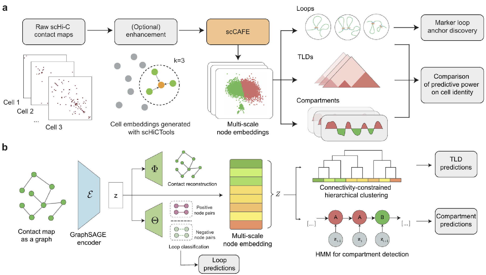

# scCAFE
Source code for "Unveiling multi-scale architectural features in single-cell Hi-C data using scCAFE"


[](https://www.biorxiv.org/content/10.1101/2024.09.10.611762v1)
[](https://doi.org/10.5281/zenodo.15006290)



## Installation


1. To get started, please clone the project repository onto your local machine, navigate to the project directory, and proceed to create a conda environment:

    ```
    git clone https://github.com/fzbio/scCAFE.git
    cd scCAFE
    conda create -n scCAFE python=3.8
    ```

2. Activate the conda environment:

    ```
    conda activate scCAFE
    ```

3. **Download the `graph_features` folder from [scCAFE assets](https://drive.google.com/drive/folders/1F5umFORCXMKsUgO-cPcvcaNKu1ojF-rr?usp=drive_link), and copy it to the `data` directory.**

4. Install PyTorch >= 2.0.1 according to its official [documentation](https://pytorch.org/get-started/previous-versions/). We recommend using [PyTorch 2.0.*](https://pytorch.org/get-started/previous-versions/#linux-and-windows-23) for best compatibility.

5. Install PyTorch-Geometric:
   ```
   conda install pyg -c pyg -c conda-forge
   ```

6. Install other dependencies using the following command:

    ```
    pip install -r requirements.txt
    ```
   
7. Install scHiCTools according to its official [documentation](https://github.com/liu-bioinfo-lab/scHiCTools). Note that the pip installation is broken, so please install it from the source.

---


## Usage:


scCAFE accepts `.scool` files as input. If this format sounds unfamiliar to you, kindly check out [Cooler](https://github.com/open2c/cooler)'s [documentation](https://cooler.readthedocs.io/en/latest/api.html#cooler.create_scool) for detailed descriptions. 

An `.scool` file of 10-kb resolution is needed to run scCAFE. 

To use scCAFE to predict architectural features, the user only needs to provide a configuration file. The configuration file is a `.json` file that specifies the parameters for the prediction. Check out the example configuration files in `config_files`. Below is the descriptions of the fields in the configuration file:


The fields of the configuration file are as follows:

``` text
Fields in the configuration JSON file:

  trained_model_id  
      Identifier of the trained model to be used.  
      Example: "mES_multitask2.5mb"  

  model_dir  
      Directory where the model files are stored.  
      Example: "models"  

  chroms  
      List of chromosomes to include in the analysis.  
      Example: ["chr1", "chr2", "chr3", "chr4", "chr5", "chr6", "chr7", "chr8", "chr9", "chr10", "chr11", "chr12", "chr13", "chr14", "chr15", "chr16", "chr17", "chr18", "chr19", "chr20", "chr21", "chr22"]  

  chrom_sizes_path  
      Path to the file containing chromosome sizes.  
      Example: "external_annotations/hg19.sizes"  

  motif_feature_path  
      Path to the file with motif-based feature data.  
      Example: "data/graph_features/human/CTCF_hg19.10kb.input.csv"  

  kmer_feature_path  
      Path to the file containing k-mer feature data.  
      Example: "data/graph_features/human/hg19.10kb.kmer.csv"  

  raw_finer_scool  
      Path to the raw .scool file containing Hi-C data.  
      Example: "data/human_prefrontal_cortex/luo_10kb_filtered.scool"  

  do_imputation  
      Boolean flag indicating whether to perform data enhancement before prediction.  
      Example: false  

  imputed_scool_dir  
      Directory to save enhanced .scool files.  
      Example: "refined_testset_scools"  

  filter_region_path  
      Path to the file specifying regions to filter out.  
      Example: "region_filter/hg19_filter_regions.txt"  

  bedpe_dict  
      A placeholder dictionary for the program. The user does not need to change this.  
      Simply put in the example in every configuration file.  
      Example: {"demo": "data/placeholder"}  

  assembly_path  
      Path to the genome assembly file.  
      Example: "/home/fuzhou/hic_research/sc-hic-loop/data/graph_features/human/hg19.fa"  

  save_to_hdf  
      Boolean flag indicating whether to save results in HDF format.  
      If not, results for each single cell will be saved in a separate .csv file.  
      Example: true  

  clustering_plot_dir  
      Directory where optimal average TLD size plot will be saved.  
      If null, no plots will be saved.  
      Example: "preds/clustering_plots"  

  ref_tad_size  
      Reference size for TLD.  
      Put an integer value to use a fixed size.  
      Put a string value pointing to a bulk TAD annotation file to use a reference distribution for TLD size.  
      Example: 20  
      
 ```


### Loop prediction


``` text
usage: python inference_experiments.py [-h] [-d] config_path pred_id

Predict loops on a single-cell Hi-C dataset.

positional arguments:
  config_path     Path to the configuration file.
  pred_id         User self-defined, unique ID of the prediction.

optional arguments:
  -h, --help      show this help message and exit
  -d, --use-data  Use existing, already enhanced data. Set this to true only when you set `imputation` to true
                  in the config file and have already run one of the inference scripts. Default: False.```
```


### TLD prediction

``` text
usage: python inference_experiments_tad.py [-h] [-d] config_path pred_id

Predict TLDs on a single-cell Hi-C dataset.

positional arguments:
  config_path     Path to the configuration file.
  pred_id         User self-defined, unique ID of the prediction.

optional arguments:
  -h, --help      show this help message and exit
  -d, --use-data  Use existing, already enhanced data. Set this to true only when you set `imputation` to true
                  in the config file and have already run one of the inference scripts. Default: False.

```


### Compartment prediction

``` text
usage: python inference_experiments_compartment.py [-h] [-d] config_path pred_id

Predict compartments on a single-cell Hi-C dataset.

positional arguments:
  config_path     Path to the configuration file.
  pred_id         User self-defined, unique ID of the prediction.

optional arguments:
  -h, --help      show this help message and exit
  -d, --use-data  Use existing, already enhanced data. Set this to true only when you set `imputation` to true
                  in the config file and have already run one of the inference scripts. Default: False.
```


### Node feature generation (If not provided in `scCAFE_assets`)

In case the species' kmer features and motif features are not provided in `scCAFE_assets`, please follow the instructions below to generate them:

```text
usage: python feature_engineering.py [-h] chrom_size_path assembly_path motif_tsv_path out_kmer_path out_motif_path

Create kmer and motif input files for the model

positional arguments:
  chrom_size_path  Path to the chrom size file (e.g., hg19.sizes). Make sure the file only contains the desired
                   chromosomes.
  assembly_path    Path to the assembly file (e.g., hg19.fa)
  motif_tsv_path   The .tsv output of a FIMO run (e.g., fimo.tsv)
  out_kmer_path    Path to the output kmer feature file
  out_motif_path   Path to the output motif feature file

optional arguments:
  -h, --help       show this help message and exit
```

---

## Example

Please run the following commands to predict loops, TLDs, and compartments on the provided example dataset:

``` bash
cd scCAFE
python inference_experiments.py config_files/demo.json demo
python inference_experiments_tad.py config_files/demo.json demo -d
python inference_experiments_compartment.py config_files/demo.json demo -d
```
After successful run, the results will be saved in the `preds` directory.


## Marker loop anchor discovery

scCAFE also provides the function to discover marker loop anchors. To use this function, please refer to the tutorial in this [notebook](https://colab.research.google.com/drive/1nJDo0ZN--c37173YKvUYJBUnrAOKkVwT?usp=sharing).
